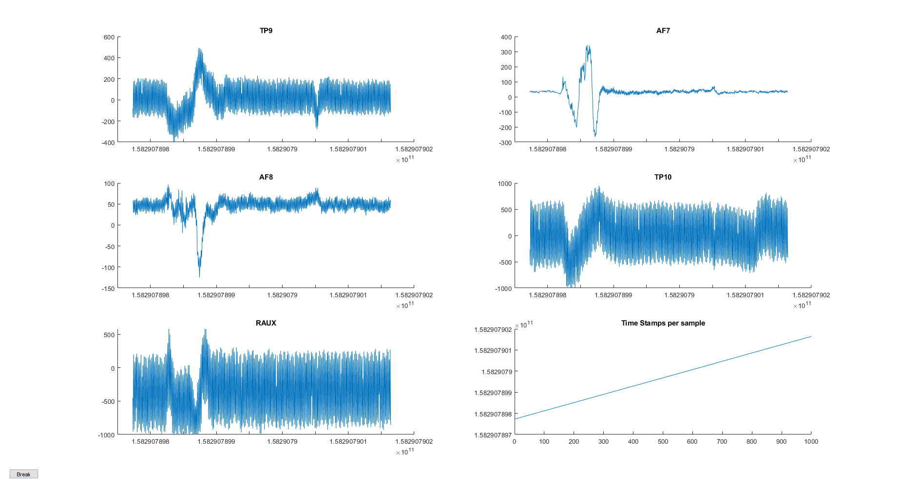

# Red Muse

A Python package for streaming (on LSL and UDP), visualizing, and recording EEG data from the Muse 2016 headband. 



## Requirements

The code relies on [pygatt](https://github.com/peplin/pygatt) for BLE communication and works differently on different operating systems.

- Windows: On Windows 10, we recommend using a BLED112 dongle and RedMuse's bgapi backend (`redmuse stream --backend bgapi`).
- Mac: On Mac, a **BLED112 dongle is required**. The bgapi backend is required and will be used by default when running RedMuse from the command line
- Linux: No dongle required. However, you may need to run a command to enable root-level access to bluetooth hardware (see [Common Issues](#linux)). The pygatt backend is required and will be used by default from the command line.

**Compatible with Python 2.7 and Python 3.x**

**Only compatible with Muse 2 and Muse 2016 (Models: MU-02 and MU-03)**

_Note: if you run into any issues, first check out out [Common Issues](#common-issues) and then the Issues section of this repository_

## Getting Started

### Installation

Install RedMuse with pip from github. 

    pip install git+git://github.com/bardiabarabadi/RedMuse.git

### Sending a Stream over UDP

Run redmuse and follow instructions on the GUI
    
    redmuse


## Citing red-muse

```
@misc{red-muse,
  author       = {Bardia Barabadi},
  title        = {red-muse},
  month        = feburary,
  year         = 2020,
  doi          = {},
  url          = {}
}
```