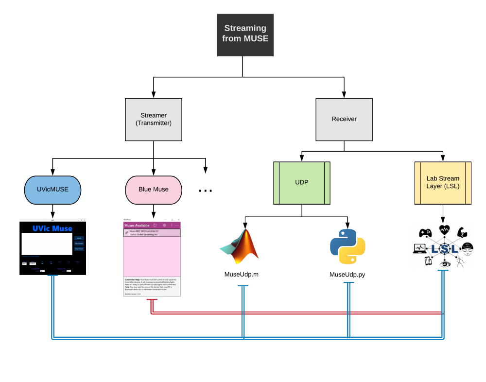

# UVic MUSE

A Python package for streaming from MUSE headsets to MATLAB and other 
platforms. 

## Requirements

The code relies on [pygatt](https://github.com/peplin/pygatt) for BLE communication 
    and [pylsl](https://github.com/chkothe/pylsl) for Muse streaming. For the best result use [BLED112](http://www.farnell.com/datasheets/2674198.pdf?_ga=2.79024144.587051681.1584504877-1039421750.1584504877&_gac=1.255907449.1584504893.Cj0KCQjw6sHzBRCbARIsAF8FMpWVas72rjYW8HkIbpjfUe97CBonZR71Yi22iGbSvDSER9rcJJ1JbqsaAit0EALw_wcB).
We highly recommend installing on a virtual environment (VE). You can build and manage those VEs using [Anaconda](https://www.anaconda.com/), 
        the instructions to install and setup a conda environment is described [here](https://docs.anaconda.com/anaconda/install/).


**Compatible with Python 2.7 and Python 3.x**

**Compatible with MUSE _MU-02_ and _MU-03_**

_Note: if you run into any issues, first check out out Common Issues
and then the Issues section of [this](https://github.com/bardiabarabadi/uvicMUSE) repository_

## Getting Started

To stream from MUSE to MATLAB ro other platforms, a _Streamer_ application is required. 
Transmitted data from _Streamer_ side then can be received and used by the _Receiver_ application. 
Take a look at this chart below:



This project has two sections, first, *UVic MUSE* that connects to MUSE 
over Bluetooth and streams its data over UDP and LSL.
Second, two classes (Python: `MuseUdp.py` & MATLAB: `MuseUdp.m`) that allow the user to receive 
*UVic MUSE* transmitted data over UDP protocol. In the following sections we go through installation and usage of *UVic MUSE*
and then explain about part two, receivers.   

### UVic MUSE Installation

On Windows we suggest the user to install Anaconda and run all of the following commands
(including optional commands) in an Anaconda Prompt. You may need to install
 [Microsoft Visual C++ Build Tools](https://visualstudio.microsoft.com/downloads/#build-tools-for-visual-studio-2017) (~1GB) from microsoft website if you don't use Anaconda.
 
On MacOS and linux, install Anaconda (or miniconda), 
open a terminal, and follow these commands:

**If you don't want to use a virtual environment, use Terminal (Linux and OSx) 
or Command Prompt (Windows) and skip the optional steps.**

(optinal) Create a new conda environment.
    
    conda create --name muse_env python=3.7
    
(optinal) Activate conda environment
    
    conda activate muse_env
    
Install UVicMUSE using `pip`

    pip install --upgrade uvicmuse

    
#### Running UVicMUSE:

To run and use *UVic MUSE* open a Terminal (Linux & OSx) or Command Prompt (Windows)
and type in the commands below:

(optional) Activate the virtual environment
    
    conda activate muse_env

Run UVicMUSE:
    
    uvicmuse
    
**If you manage to install UVicMUSE without conda in Windows, you can run it by opening the start menu
and typing uvicmuse**

#### GUI: 


#### Streaming Procedure:
Follow steps shown below to stream the MUSE sensory data. Remember to correctly specify the **Required Entries** variables
before moving on to the next step. 

1. Search to get a list of available MUSEs
2. Connect to one of the MUSEs. **Required Entries** = Checkboxes (UDP, LSL, EEG, PPG, ACC, GYRO) 
3. Start Streaming over UDP and LSL (if enabled). **Required Entries** = Filters (Highpass, Lowpass, Notch), UDP (Address, Port)

Notes:
* The UDP port should be the same as you use in `MuseUdp.m` and `MuseUdp.py`
* Stopping the stream won't disconnect the MUSE (use this feature for changin UDP port or filters)
* Search is required after disconnecting from a MUSE 


## Citing UVicMUSE

```
@misc{UVicMUSE,
  author       = {Bardia Barabadi},
  title        = {uvic-muse},
  month        = March,
  year         = 2020,
  doi          = {},
  url          = {}
}
```